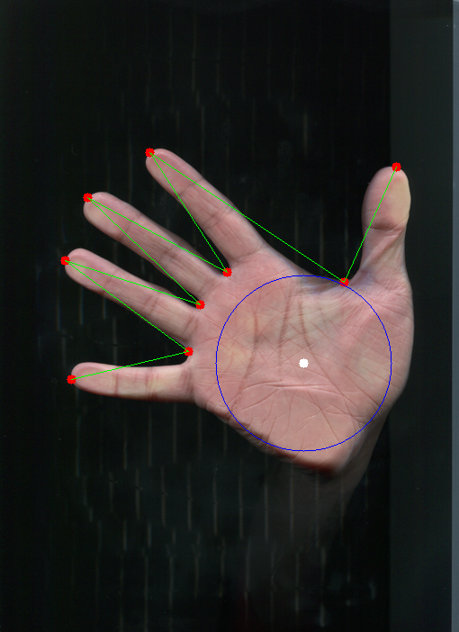

# hand_detection
[REPORT HERE](https://yadi.sk/i/GKiEjQD5y7OjHQ)   
[JUPYTER NOTEBOOK](https://github.com/valerapon/hand_detection/blob/master/notebook.ipynb)  
How to run:  
```python test.py <images_path>```  
Example:  
```python main.py training\157.tif training\105.tif```  
Output:  
In folder ```image``` files ```157.tif, 105.tif``` 

 
